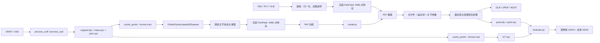

# Particulate 代码链路与架构解析

本文基于 2026-09-01 当前工作区代码整理，覆盖数据预处理、训练、推理、导出和 evaluation。文中的行为以源码为准；README 中已经失效的 `cache_gt.py` 不作为实现依据。

## 1. 代码导航

| 文件 | 职责 |
| --- | --- |
| `train.py` | 训练入口：数据集、PartField 特征、PAT 损失、优化器和 checkpoint |
| `infer.py` | 推理入口：网格加载、采样、PartField、PAT、面标签和结果导出 |
| `evaluate.py` | evaluation 入口：加载预测/GT、重新采样、逐物体和总体指标 |
| `configs/particulate-B.yaml` | 发布模型的推理结构参数 |
| `configs/train-particulate-B.yaml` | 发布模型的训练参数和损失权重 |
| `partfield_utils.py` | 加载冻结的 PartField，并从 triplane 查询 448 维点特征 |
| `particulate/models.py` | PAT 主模型、预测头、训练损失和推理后处理 |
| `particulate/datasets.py` | 训练样本读取、在线关节状态合成、增强和 batch padding |
| `particulate/matcher.py` | 预测 query 与 GT part 的 Hungarian 匹配 |
| `particulate/inference_utils.py` | 从邻接 logits 提取最大生成有向树 |
| `particulate/postprocessing_utils.py` | 点标签投影到网格面及连通性修正 |
| `particulate/articulation_utils.py` | Plücker 轴、层级运动、点/网格/AABB 变换 |
| `particulate/evaluation_utils.py` | Chamfer、GIoU、mIoU 和多状态 articulation 评测 |
| `particulate/export_utils.py` | 动画 GLB、URDF、MJCF 导出 |
| `particulate/data/*.py` | URDF/USD 预处理和 train/eval 点缓存 |

## 2. 端到端总览



核心关系可以概括为：PartField 负责把几何点变成具有部件语义的 448 维特征，PAT 再用固定数量的 part queries 联合预测分件、运动层级和关节参数。

## 3. 数据预处理与存储格式

### 3.1 URDF/USD 到统一资产目录

入口分别是：

```bash
python -m particulate.data.process_urdf <mobility.urdf> <asset_dir>
python -m particulate.data.process_usd <asset.usd> <asset_dir>
```

两条链路都会合并 fixed joint，相应链接共享一个 part ID；随后把网格归一化到最大边长约为 1 的中心坐标系，并同步变换关节轴和移动范围。每个资产目录包含：

| 文件 | 关键字段 |
| --- | --- |
| `original.obj` | 合并后的三角网格，顶点顺序与 `vert_to_bone` 对齐 |
| `meta.npz` | `vert_to_bone[V]`、`bone_structure[E,2]` |
| `link_axes_plucker.npz` | 每个 part 12 维：`0:6` revolute Plücker，`6:12` prismatic 轴存储 |
| `link_range.npz` | 每个 part 4 维：revolute `[low, high]`、prismatic `[low, high]` |

模型实际从 prismatic 的 6 维存储中只读取 `6:9` 作为方向。运动类别编码为：0 静止、1 revolute、2 prismatic、3 两者都有。

### 3.2 训练缓存

```bash
python -m particulate.data.cache_points \
  --root <asset_dir> \
  --output_path <cached_dir>/<asset>.npz \
  --num_points 40000 \
  --ratio_sharp 0.5 \
  --format train
```

训练缓存字段：

| 字段 | 含义 |
| --- | --- |
| `points[P,3]` | sharp edge 与均匀表面混合采样点 |
| `normals[P,3]` | 对应法线 |
| `point_to_bone[P]` | 点所属 part |
| `point_from_sharp[P]` | 是否来自 sharp edge |
| `bone_structure[E,2]` | parent→child 边 |
| `link_axes_plucker[M,12]` | 关节轴参数 |
| `link_range[M,4]` | 关节范围 |

`cache_points` 要求每个三角面的三个顶点属于同一 part，否则该资产返回失败。

### 3.3 Evaluation GT 缓存

旧 `particulate.data.cache_gt` 已合并进 `cache_points.py`。当前正确命令为：

```bash
python -m particulate.data.cache_points \
  --root <asset_dir> \
  --output_path <gt_dir>/<asset>.npz \
  --num_points 100000 \
  --ratio_sharp 0 \
  --format eval
```

GT 输出字段与 `evaluate.py` 直接对齐：`points`、`part_ids`、`motion_hierarchy`、两种运动 flag、两种轴和两种 range。

## 4. PartField 特征提取

入口是 `partfield_utils.obtain_partfield_feats(partfield_model, points_enc, points_dec)`。

1. 用 `points_enc` 的包围盒计算中心和尺度，将编码点最大边映射到约 `[-0.9, 0.9]`。
2. `TriPlanePC2Encoder/PVCNN` 将全局点云编码为三平面特征。
3. `TriplaneTransformer` 输出 512 通道高分辨率 triplane。
4. 前 64 通道是 PartField 的 SDF 特征，本项目丢弃。
5. 后 448 通道是 part feature，在 `points_dec` 位置对 XY、YZ、XZ 三平面做 `grid_sample` 并求和。
6. 返回 `feats[B,N,448]`，作为 PAT 的主要外观/部件语义输入。

训练和推理中 PartField 都处于 `eval()` 与 `no_grad()`，不进入 PAT 优化器。`obtain_partfield_feats` 使用 CUDA bfloat16 autocast。

两套点的作用不同：

- `points_enc/all_points`：较密的全局点云，用于建立 triplane。
- `points_dec/xyz`：PAT 真正处理和分件的点，在 triplane 上查询 448 维特征。

## 5. PAT 主模型架构

### 5.1 发布配置 PAT-B

`configs/particulate-B.yaml` 对应：

| 参数 | 值 |
| --- | ---: |
| PartField 输入维度 | 448 |
| hidden size | 768 |
| attention blocks | 6 |
| attention heads | 12 |
| 最大 part queries | 16 |
| mask hypotheses | 1 |
| 使用法线 | 是 |
| 使用 raw xyz/normal | 是 |
| motion representation | `per_point_closest` |
| 参数量 | 151,325,203 |

模型变体在 `models.py` 末尾定义：S=`6×384/6 heads`，B=`6×768/12`，L=`12×1024/16`，XL=`14×1152/16`。当前发布权重和配置使用 B。

### 5.2 关键张量

| 符号 | 形状 | 含义 |
| --- | --- | --- |
| `B` | - | batch size |
| `P` | - | PartField 全局编码点数 |
| `N` | - | PAT 解码点数 |
| `M` | 16 | 最大 part/query 数 |
| `C` | 448 | PartField feature 维度 |
| `D` | 768 | PAT-B hidden size |
| `xyz` | `[B,N,3]` | 解码点坐标 |
| `feats` | `[B,N,448]` | PartField 点特征 |
| `x` | `[B,N,768]` | PAT 点 token |
| `q` | `[B,M,768]` | part query token |
| `point_mask` | `[B,N,M]` | 每点属于各 query 的 logits |

源码中个别注释写成 `(B,M,N)`，但 decoder 的实际布局是 `[B,N,M]`。

### 5.3 输入嵌入

点 token 为三项相加：

```text
x = Linear(PartField 448D) + PosEmbed(xyz) + PosEmbed(normal)
```

位置嵌入对每个坐标做 64 维 sin/cos frequency embedding，并在当前配置中拼接 raw coordinate 后经过两层 MLP。

query 不从输入点采样。默认用归一化的 part index `0/M ... (M-1)/M` 经过同一类频率嵌入，形成 16 个有序 part queries。代码也保留 `query_xyz/query_feats` prompt 接口，但当前训练配置关闭 point prompt，text prompt 尚未实现。

### 5.4 一个 PAT Block

每层没有昂贵的 point-to-point self-attention，而是：

```text
q <- SelfAttention(q)
q <- q + CrossAttention(query=q, context=x)
x <- x + CrossAttention(query=x, context=q)
x <- x + FFN(x)
q <- q + FFN(q)
```

因此主干 attention 复杂度主要是 `O(NM)`，不是 `O(N²)`。不过 point mask decoder 会显式扩展并拼接 `[B,N,M,2D]`，点数很大时仍会产生明显显存压力。

### 5.5 联合预测头

同一组 point/query token 进入六类预测头：

1. **Point mask**：拼接每个 `x_n` 与 `q_m`，MLP 输出 `[B,N,M]`。
2. **Motion hierarchy**：拼接每对 query `(q_parent,q_child)`，输出 `[B,M,M]` 邻接 logits。
3. **Motion class**：每个 query 输出 4 类 logits。
4. **Revolute**：当前配置每个 query 输出 axis 3 维和 range 2 维。
5. **Prismatic**：每个 query 输出 axis 3 维和 range 2 维。
6. **Per-point axis point**：拼接 point token 与其 part query，给每个点预测轴上最近点 `[B,N,3]`。

发布模型不直接回归完整 revolute Plücker。推理后对每个 revolute part 的最近轴点取中位数，再与 query 预测的轴方向组合成 `[l,m]`，其中实现采用 `m = l × point`。

## 6. 训练链路

### 6.1 Dataset 在线合成

`OntheFlyArticulated3DDataset._getitem` 不只是读取缓存，而是在线生成训练姿态：

1. 从缓存点中按 `sharp_point_ratio` 分层采样 `N=2048`。
2. 可选 Z 轴 0/90/180/270 度旋转。
3. 按 `resting_state_prob` 采样全静止或每 part 独立关节状态。
4. `articulate_points` 按 root→leaf 顺序变换当前 part 及整个子树，同时更新子关节轴、range 和法线。
5. 将点云归一化到中心单位包围盒，并同步平移/缩放 Plücker 轴和 prismatic range。
6. 应用随机 scale、rotation、translation。
7. 为每个 revolute part 计算每个点在 GT 轴上的最近点。
8. 按概率将整份 normal 置零，增强对缺失法线的鲁棒性。

当 `compute_feat_on_the_fly=true` 时，选中的 2048 点和完整缓存点会一起做相同 articulation/augmentation，随后拆回 `xyz` 与 `all_points`，保证 PartField 编码点和 PAT 解码点处于同一姿态。

### 6.2 Batch 组织

不同资产的 part 数不同，`collate_fn` 将 part 相关张量 padding 到 `model_max_parts=16`，并用 `num_valid_parts` 控制 loss mask。`part_structure_matrix` padding 为 `[B,16,16]`。

多个数据集先组成 `ConcatDataset`，`WeightedConcatSampler` 根据各数据集的 `sampling_rate` 反复有放回采样，单 epoch 固定产生 `samples_per_epoch=102400` 个样本。

### 6.3 Query 与 GT 对齐

part queries 本身没有天然对应 GT part。训练时 `HungarianMatcher`：

1. 对 point mask logits 做 `log_softmax`。
2. 对每个 GT part，累加其所有点在每个 query 列上的 log probability。
3. 以负 log-probability 为 cost，调用 SciPy `linear_sum_assignment`。
4. 按匹配结果重排 query 和 mask 列，使前 `num_valid_parts` 列与 GT part ID 对齐。

随后训练阶段直接使用 GT `part_ids` 为每个点选择对应 query，监督 per-point axis-point decoder。

### 6.4 损失函数

总损失是以下分量的加权和：

| 名称 | 实现 | 默认权重 |
| --- | --- | ---: |
| `point_mask_loss` | point-wise cross entropy | 1.0 |
| `dice_loss` | valid parts 上的 soft Dice | 1.0 |
| `motion_hierarchy_loss` | valid 邻接子矩阵 BCE，带正样本权重 | 1.0 |
| `part_motion_classification_loss` | 4 类 cross entropy | 1.0 |
| `part_motion_axis_loss_revolute` | 有效 revolute axis 的 L1 | 1.0 |
| `part_motion_axis_loss_prismatic` | 有效 prismatic axis 的 L1 | 1.0 |
| `part_motion_range_loss_revolute` | 非零 revolute range 的 L1 | 0.1 |
| `part_motion_range_loss_prismatic` | 非零 prismatic range 的 L1 | 1.0 |
| `point_closest_point_on_axis_loss` | revolute 点的最近轴点 L1 | 1.0 |

### 6.5 优化与 checkpoint

`train.py` 使用 Accelerate 支持梯度累积和多 GPU：

- AdamW；基础学习率 `5e-7`。
- `scale_lr=true` 时乘以进程数、梯度累积步数和 batch size；单卡 batch 16 时实际初始 LR 为 `8e-6`。
- warmup 1000 steps，之后 cosine schedule，最低为峰值的 10%。
- gradient norm clip 1.0。
- 每 10 steps 记录 loss，每 10000 steps 保存 Accelerate state 和 `model.pt`。
- 最终保存 `final_model/model.pt`。

训练命令：

```bash
accelerate launch train.py --config configs/train-particulate-B.yaml
```

正式运行前必须把配置中的数据路径和 `output_dir: ./runs` 改到本项目允许的 `/data2/LiuShuqi/data/processed/...` 与 `/data2/LiuShuqi/output/particulate/...`。

## 7. 推理链路

### 7.1 模型和输入

`infer.py` 支持 OBJ、PLY、GLB；glob 输入会为每个匹配资产创建独立输出目录。主模型由 `configs/particulate-B.yaml` 实例化，权重来自 `--ckpt_path` 或 Hugging Face。PartField 权重从 `PARTFIELD_MODEL_DIR` 读取。

```bash
python infer.py \
  --input_mesh <mesh.obj> \
  --ckpt_path <model.pt> \
  --output_dir <asset_output_dir> \
  --up_dir=-Z \
  --num_points 22000
```

### 7.2 坐标处理与双路采样

`predict_mesh`：

1. 根据 `--up_dir` 将输入旋转到 Z-up。
2. 用全网格 bbox 中心化，并除以最大边长，得到约 `[-0.5,0.5]` 的网格。
3. 固定采样 40000 个 `points_enc`。
4. 采样 `--num_points` 个 `points_dec`，默认 sharp/uniform 各 50%。
5. 根据两组采样点再次估计 bbox 并归一化。
6. PartField 从 40000 个全局点构建 triplane，在解码点查询 448 维特征。
7. PAT 以 `xyz + normal + feature` 推理。

当前 smoke test 使用 `num_points=22000`；默认 102400 点会显著放大 PartField、cross-attention 和 `[N,M,2D]` mask decoder 的显存占用。

### 7.3 PAT 推理后处理

`PAT.infer` 当前只支持 batch size 1。发布配置只有一个 mask hypothesis，虽然接口支持返回多个 hypothesis。

1. `argmax(point_mask)` 得到点 part ID。
2. 没有任何点命中的 query 列被置为 `-inf`。
3. 若设置 `min_part_confidence`，以该 part 所有点概率的几何平均作为置信度，低置信 part 被删除并重新 argmax。
4. 仅保留实际出现 part 的邻接子矩阵。
5. 对所有不同 part 之间的有向边使用 `logsigmoid(logit)` 作为权重，由 NetworkX Edmonds 算法提取 maximum spanning arborescence。
6. motion class argmax 转成 revolute/prismatic flag。
7. 轴方向单位化；per-point closest 结果转换为 revolute Plücker。

### 7.4 点标签到网格面

`find_part_ids_for_faces` 先对落在同一面的采样点做多数投票，再处理没有采样点的面和连通性：

- 默认 `strict=True`：每个网格 connected component 只保留表面积占优的一个 part；全未定义 component 从最近的已定义 component 继承标签。
- `--no_strict`：先按最近面填充未定义标签，再迭代合并同一 part 的较小离散 component，目标是每个 part 在一个网格 component 内连通。

默认 strict 对“一个几何 connected component 内包含多个真实运动 part”的网格可能过度合并；这时应比较 `--no_strict`。

### 7.5 输出

常规输出包括：

- `mesh_parts_with_axes_<timestamp>.glb`：分件着色和预测轴。
- `animated_textured_<timestamp>.glb`：从 state 0 到 1 的烘焙动画。
- 可选 URDF：每个 part 独立 mesh，并按预测树建立 joint。
- 可选 MJCF：同样的层级和关节参数转换为 MuJoCo XML。

带 `--eval` 时增加：

- `eval/pred.obj`
- `eval/pred.npz`：`face_part_ids`、压缩后的 hierarchy、运动 flag、轴和 range。

删除或后处理掉某些 part 后，代码会重编号 part，并跨过缺失中间节点建立 induced tree。

## 8. Evaluation 链路

### 8.1 输入结构

```text
<result_dir>/<asset>/eval/pred.obj
<result_dir>/<asset>/eval/pred.npz
<gt_dir>/<asset>.npz
```

```bash
python evaluate.py \
  --gt_dir <gt_dir> \
  --result_dir <result_dir> \
  --output_dir <new_eval_output_dir> \
  --num_points 100000
```

`process_prediction` 从 `pred.obj` 均匀重采样 `num_points` 个点，并用采样命中的 face 查询 `face_part_ids`。默认正式评测为 100000 点，smoke 使用 2000 点。

### 8.2 Part 对齐

预测 part ID 与 GT part ID 没有直接语义对应。评测默认分别计算每个 part 的点中心，以中心欧氏距离构造 cost matrix，做两次 Hungarian：prediction→GT 与 GT→prediction。代码也保留 Chamfer cost 选项，但 `evaluate.py` 固定使用 `cdist`。

### 8.3 指标

在 rest pose 和 5 个状态 `0, 0.25, 0.5, 0.75, 1` 上评测：

- **Per-part Chamfer**：PyTorch3D 双向平方 L2 Chamfer；两个映射方向再平均。
- **Overall Chamfer**：忽略 part 标签，对完整点云计算 Chamfer。
- **mIoU**：匹配 part 的 axis-aligned bbox IoU。
- **GIoU**：rest pose 使用 AABB GIoU；运动状态对 bbox 采样并施加预测/GT 层级变换后估计重叠。

未匹配 part 在普通指标中会受到惩罚：Chamfer 使用物体 bbox 对角线的一半，GIoU 使用 -1，mIoU 使用 0。`nopunish` 版本只平均成功匹配项。

`fully_*` 指标取最后一个 articulation state；逐状态数组完整写入 `<asset>.json`。最后再生成 `OVERALL_EVAL_RESULTS.json` 和 `OVERALL_EVAL_RESULTS_NOPUNISH.json`。

Evaluation 使用当前环境的官方 PyTorch3D 0.7.9 CUDA Chamfer。运行命令见 `RUNBOOK.md`。

## 9. 当前实现的重要边界

1. **Evaluation 有缓存**：若 `<output_dir>/<asset>.json` 已存在，只读取旧 JSON，不重新计算。切换后端、点数或代码后应使用新的 output directory。
2. **Evaluation 非确定性**：`pred.obj` 表面采样和 articulated GIoU 的 bbox 采样没有固定随机种子，同一模型的 smoke 指标会有小幅波动。
3. **`pred.obj` 归一化假设**：`evaluate.py` 强制预测点位于 `[-0.5,0.5]`；但 `infer.py --eval` 当前导出的是加载时的 `mesh`，不是用于预测的 `mesh_transformed`。未预先归一化的输入可能在 evaluation assertion 处失败。
4. **运动状态约定有细微差异**：`articulate_points` 使用 `low + state*(high-low)`；articulated GIoU 的 `articulate_bbox` 使用 `state*(high-low)`。因此 GIoU bbox 变换与点云变换并非完全相同的零点约定。
5. **CUDA 是实际依赖**：推理入口显式要求 CUDA；Chamfer 将点张量放到 CUDA，evaluation 也需要可用 GPU。
6. **PartField 是冻结依赖而非 PAT 子模块**：PAT checkpoint 不包含 PartField 权重，部署必须同时准备两个 checkpoint。
7. **最大 part 数固定为 16**：训练时超过 16 parts 的资产会被 dataset 拒绝；推理最多产生 16 个 query part。
8. **README 的 `cache_gt.py` 已过期**：应使用 `cache_points --format eval`；历史脚本的批处理功能现在由 shell `find/xargs` 承担。

## 10. 推荐阅读顺序

若要修改模型或定位问题，建议按以下顺序阅读：

1. `configs/particulate-B.yaml`
2. `partfield_utils.py`
3. `particulate/models.py`：`forward_attn` → `forward_results` → `forward/infer`
4. `particulate/matcher.py` 与 `particulate/inference_utils.py`
5. `particulate/datasets.py::_getitem`
6. `train.py`
7. `infer.py::predict_mesh/save_articulated_meshes/infer_single_mesh`
8. `particulate/postprocessing_utils.py`
9. `evaluate.py` 与 `particulate/evaluation_utils.py`
10. `particulate/articulation_utils.py` 与 `particulate/export_utils.py`
